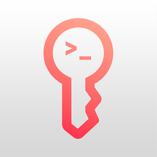

<div align="center">
  <a href="https://github.com/bendews/apw">
    
  </a>

<h3 align="center">Apple Passwords CLI</h3>

<p align="center">
    A CLI for access to Apple Passwords. A foundation for enabling integration and automation.
    <br />
    <a href="https://github.com/bendews/apw"><strong>Explore the docs »</strong></a>
    <br />
    <br />
    <a href="https://github.com/bendews/apw">View Demo</a>
    ·
    <a href="https://github.com/bendews/apw/issues">Report Bug</a>
    ·
    <a href="https://github.com/bendews/apw/issues">Request Feature</a>
  </p>

[![Contributors][contributors-shield]][contributors-url] [![Forks][forks-shield]][forks-url]
[![Stargazers][stars-shield]][stars-url] [![Issues][issues-shield]][issues-url]
[![MIT License][license-shield]][license-url]
<br />

</div>

<!-- ABOUT THE PROJECT -->

## About The Project

This project introduces a CLI interface designed to access iCloud passwords and OTP tokens. The core objective is to
provide a secure and straightforward way to retrieve iCloud passwords, facilitating integration with other systems or
for personal convenience.

It utilises a built in helper tool in macOS 14 and above to facilitate this functionality.

https://github.com/user-attachments/assets/8cb45571-d164-4e28-aa6e-64d27705d6d2

## Getting Started

**APW requires a supported browser with the <ins>iCloud Passwords extension installed</ins>**:

- **Ungoogled Chromium**: `brew install --cask ungoogled-chromium`
- or **Google Chrome**: `brew install --cask google-chrome`
- or **Brave Browser**: `brew install --cask brave-browser`
- or **Microsoft Edge**: `brew install --cask microsoft-edge`

<ins>Link to iCloud Passwords Extension:
[Link](https://chromewebstore.google.com/detail/icloud-passwords/pejdijmoenmkgeppbflobdenhhabjlaj)</ins>

> **Note:** The browser is launched headlessly in the background. It will generally not be usable for regular browsing
> while `apw` is running. Installing one of the above as a dedicated secondary browser is recommended.

### Quick Start

**1. Install APW**

```sh
brew install bendews/homebrew-tap/apw
```

**2. Start the daemon**

APW will detect the browser and extension automatically. To start at login:

```sh
brew services start apw
```

**3. Authenticate**

This step is required every time the daemon starts (e.g. on boot):

```sh
apw auth
```

A native macOS popup with a PIN will appear. Enter it when prompted to complete pairing.

---

APW is now running and ready to use.

## Integrations

The following integrations provide quick access to passwords and OTP tokens:

- [Raycast extension](https://www.raycast.com/bendews/apple-passwords) automatically retrieves entries for the currently active
webpage and enters them.
- [LaunchBar action](https://github.com/andesco/launchbar-apple-passwords) finds entries for a typed domain and pastes the
selected entry.

The following are some future integration ideas:

- SSH Agent to allow storing and using SSH keys/passwords
- Additional wrappers for CLI tools and services

## Usage

Ensure the daemon is running (`apw start` or `brew services start apw`) and authenticated (`apw auth`).

Start with a specific browser without the interactive prompt, selections will be persisted:

`apw start --browser chrome`

Query for available passwords (Interactive):

`apw pw`

Query for available passwords (JSON output):

`apw pw list google.com`

Create or update a password (the command prompts for the password):

`apw pw save google.com username`

Retrieve a one-time code:

`apw otp get google.com`

View more commands & help:

`apw --help`

```shell
Options:

  -h, --help     - Show this help.                            
  -V, --version  - Show the version number for this program.  

Commands:

  auth   - Authenticate CLI with daemon.         
  pw     - Interactively list or save accounts/passwords.
  otp    - Interactively list accounts/OTPs.     
  start  - Start the daemon.
```

<!-- CONTRIBUTING -->

## Building

This project uses Deno for development and compilation. Make sure you have Deno installed on your system before
proceeding.

### Running the Project

To run the project whilst developing:

```shell
deno task dev <OPTIONS>
```

### Building a release version

To build a statically compiled binary:

```shell
deno task compile
```

## Contributing

Contributions are what make the open source community such an amazing place to learn, inspire, and create. Any
contributions you make are **greatly appreciated**.

If you have a suggestion that would make this better, please fork the repo and create a pull request. You can also
simply open an issue with the tag "enhancement". Don't forget to give the project a star! Thanks again!

1. Fork the Project
2. Create your Feature Branch (`git checkout -b feature/AmazingFeature`)
3. Commit your Changes (`git commit -m 'Add some AmazingFeature'`)
4. Push to the Branch (`git push origin feature/AmazingFeature`)
5. Open a Pull Request

## License

Distributed under the GPL V3.0 License. See `LICENSE` for more information.

<!-- MARKDOWN LINKS & IMAGES -->
<!-- https://www.markdownguide.org/basic-syntax/#reference-style-links -->

[contributors-shield]: https://img.shields.io/github/contributors/bendews/apw.svg?style=for-the-badge
[contributors-url]: https://github.com/bendews/apw/graphs/contributors
[forks-shield]: https://img.shields.io/github/forks/bendews/apw.svg?style=for-the-badge
[forks-url]: https://github.com/bendews/apw/network/members
[stars-shield]: https://img.shields.io/github/stars/bendews/apw.svg?style=for-the-badge
[stars-url]: https://github.com/bendews/apw/stargazers
[issues-shield]: https://img.shields.io/github/issues/bendews/apw.svg?style=for-the-badge
[issues-url]: https://github.com/bendews/apw/issues
[license-shield]: https://img.shields.io/github/license/bendews/apw.svg?style=for-the-badge
[license-url]: https://github.com/bendews/apw/blob/master/LICENSE.txt
[product-screenshot]: images/screenshot.png
